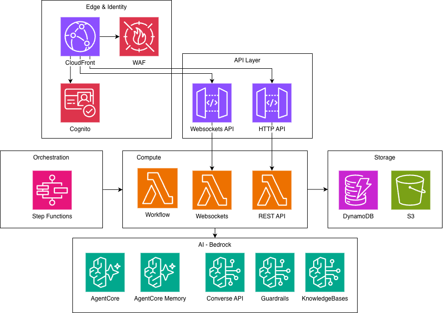

# Assess Workbench

Assess Workbench enables the assessment of key business documents by developing a custom workflow for each project, selecting the most relevant agents to conduct specialist assessments such as architecture, risk, security, and compliance reviews. These agents are completely customizable, and you can create new agents for your specific needs.

Once the plan is created it's presented to the user for further refinement and approval. A quality judge then scores each agent's output for completeness, specificity, and actionability, with an optional coaching loop to iteratively improve results. Users are presented with traceable findings, recommendations, and remediation, and can chat directly with each specialist agent to explore the reasoning or ask follow-up questions.

Assess Workbench can be applied to any industry and geography. The reference corpus of standards can include international frameworks, regulator commentary, and company-specific policies — and is easily updated as guidance evolves. Assessment projects can focus on any documents that require assessment — from technical documents like concept papers and design documents to business documents like policies, committee charters, or existing risk assessments.

## Features

- **Multi-File Upload** — Drag-and-drop upload with parallel pre-signed URL uploads
- **PDF & Image Analysis** — PyMuPDF text extraction, two-pass image analysis (triage + deep analysis of diagrams)
- **Adaptive Workflow** — AI planner analyzes documents and produces dynamic review plans
- **Plan Preview & Approval** — Users review and customize AI-generated plans before execution
- **Multi-Agent Review** — Specialist agents run in parallel or sequential groups, with cross-agent context sharing via shared memory
- **Quality Judge** — Evaluator scores every review (completeness, specificity, actionability); optional coach loop refines agent output iteratively
- **Live Review Visualization** — Animated agent graph showing real-time review progress with coach loop animation
- **User Feedback** — Thumbs up/down on individual findings, aggregated for quality tracking
- **Traceable findings and recommendations** — Every finding links back to the specific document sections and standards that informed it, so reviewers can verify the reasoning and follow the evidence chain
- **Standards Knowledge Base** — Agents ground their assessments against a curated corpus of compliance standards, regulatory frameworks, and organisational policies via Bedrock Knowledge Bases. The corpus is easily updated with the latest regulator commentary and guidance, which evolves far faster than international standards
- **Real-Time Chat** — WebSocket streaming chat with each agent, with full access to the review findings and source document for deep-dive follow-up
- **Analytics Dashboard** — Quality trends, coverage matrix, user feedback summary, model comparison
- **Admin Page** — Configure agents, finding schemas, and quality thresholds without code changes
- **Benchmarks** — Compare models and configurations side-by-side with automated quality scoring

## Architecture

### Technology Stack

- **Frontend**: Preact, Vite
- **Backend**: API Gateway (HTTP + WebSocket), Lambda (Python 3.13), Step Functions, DynamoDB, S3
- **AI**: Strands Agents, Bedrock (Claude Sonnet 4, Knowledge Bases), AgentCore Runtime, AgentCore Memory
- **Infrastructure**: Terraform (modular), Cognito (auth), SSM Parameter Store (config)
- **Observability**: CloudWatch, X-Ray, AgentCore OpenTelemetry

## Setup

See [SETUP.md](SETUP.md) to deploy Assess Workbench into your own AWS account.

## Security

See [CONTRIBUTING](CONTRIBUTING.md#security-issue-notifications) for more information.

## License

This library is licensed under the MIT-0 License. See the LICENSE file.