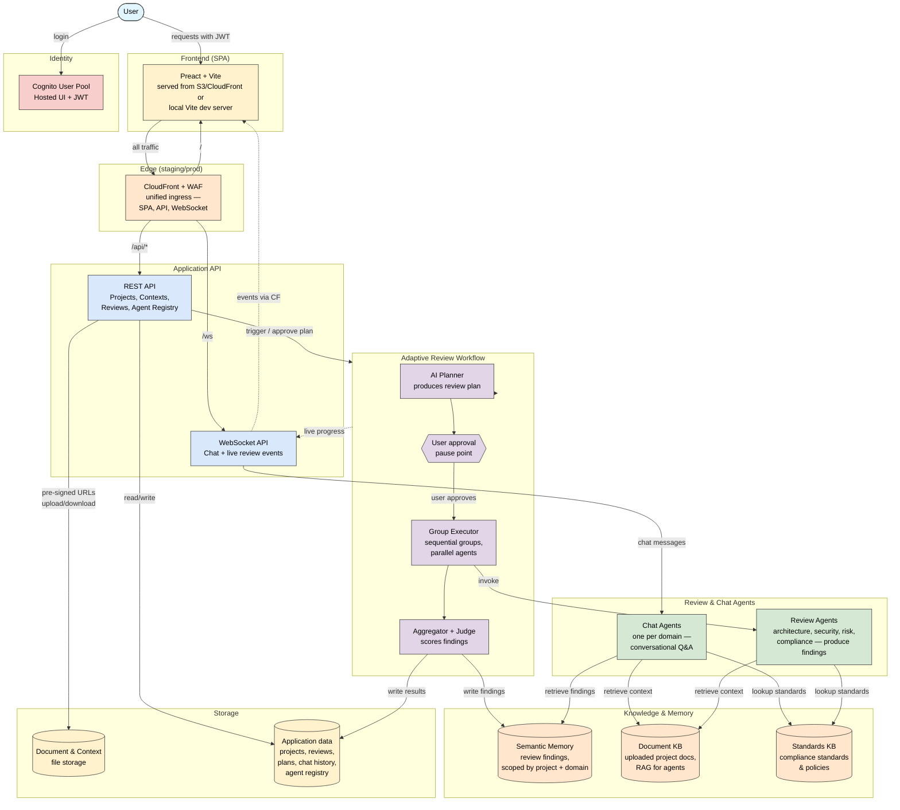

# Architecture Overview

High-level view of how the Solution Design Review application fits together. This is the "explain the system in one picture" diagram — logical components, not AWS services or Lambda function names. For concrete AWS resources, see [aws-services.md](aws-services.md). For the narrative walkthrough, see [system-overview.md](system-overview.md).

> **Last verified:** 2026-04-21 against `terraform/`, `api/`, and `agents/`. Re-verify when adding a new subsystem (auth model, new agent class, new KB).

## The big picture

## How it flows

The application has three interaction modes, all gated by Cognito. In staging/prod, all browser traffic enters through a single CloudFront distribution with WAF — the SPA, API calls, and WebSocket connections share one edge. In dev, the Vite dev server talks to API Gateway directly.

**Authoring a project.** The user uploads one or more design documents through the SPA. The REST API issues pre-signed URLs so the browser uploads directly to object storage, and writes project metadata to the application data store.

**Running a review.** The user triggers a review through the REST API. The Adaptive Review Workflow takes over:

1. An AI planner reads the document(s) and produces a tailored review plan — which agents to run, how to group them (parallel within a group, sequential across groups), which focus areas to emphasise, and how deeply to dig.
2. The workflow pauses for user approval of the plan. The SPA displays it; the user can modify it.
3. Once approved, the executor invokes review agents group by group. Agents read the document, pull context from the Document KB and Standards KB, and produce structured findings.
4. The aggregator collects findings, a judge scores them, and results are written to both the application data store and semantic memory.

Throughout the workflow, progress events flow out through the WebSocket API so the SPA can render live progress.

**Chatting about findings.** Once a review is complete, the user opens a chat tab for any domain (architecture, security, risk, compliance). Chat agents retrieve relevant findings from semantic memory, supplement them with the original document and standards lookups, and stream responses back through the WebSocket.

## What's deliberately not shown

- **AWS service names.** API Gateway, Lambda, Step Functions, DynamoDB, S3, Bedrock — those live in [aws-services.md](aws-services.md). The components here map cleanly to AWS services but naming them up front obscures the logical structure.
- **Individual Lambda functions.** Each box above may be one or several Lambdas. The boundary that matters for understanding the system is the logical subsystem, not the execution unit.
- **Security boundaries and encryption.** Auth is shown as a gate here but the full picture — trust boundaries, IAM roles, encryption at rest and in transit, origin lockdown — is in [security-architecture.md](security-architecture.md).

## Key design choices

- **Adaptive, not fixed.** The review plan is generated per-document by an AI planner, not hardcoded. Adding a new review agent means updating the agent registry, not changing orchestration code.
- **Findings as first-class data.** Review agents produce structured findings (not free-text summaries). The same findings drive the UI, the chat context, and any downstream analysis.
- **Memory is separate from conversation.** Semantic memory is populated by the review workflow and read by chat agents. Chat history lives in the application data store. This keeps review findings searchable across projects without mixing conversational turns into the index.
- **WebSocket for everything real-time.** Both chat and live review progress flow through the WebSocket API. The REST API is strictly request/response.
