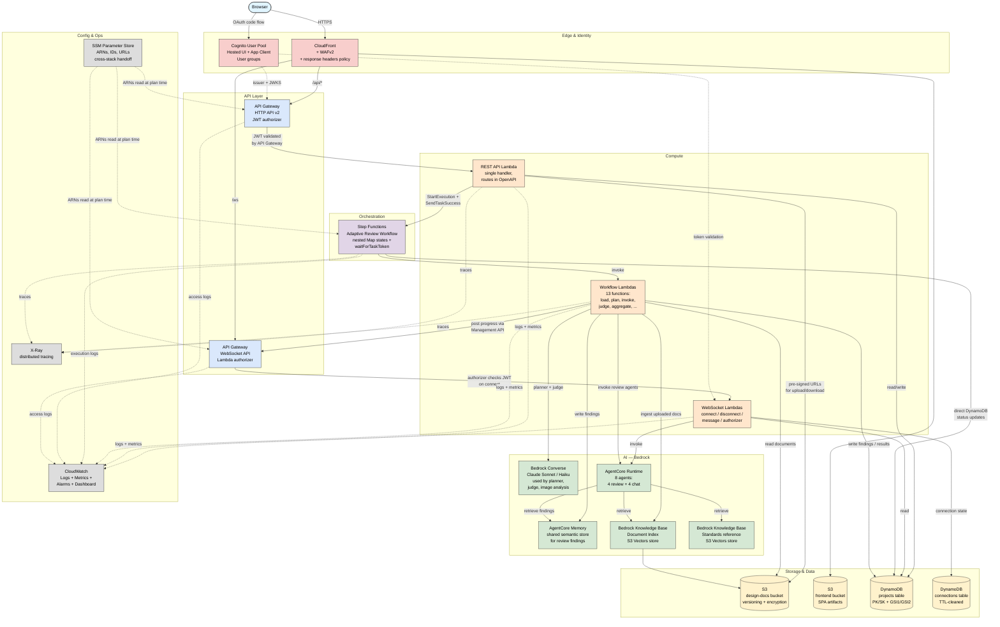

# AWS Services

The concrete AWS resources that make up the application and how they're wired. Pair this with [architecture-overview.md](architecture-overview.md) — that file shows logical components, this file shows the AWS services behind them.

> **Last verified:** 2026-04-21 against `terraform/`. Re-verify when adding a new AWS service to the stack.

## Services in use

## Service-by-service breakdown

### Edge & Identity

| Service | Purpose |
|---------|---------|
| **CloudFront** (+ WAFv2, response headers policy) | Unified ingress for all browser traffic in staging/prod. Serves the SPA from S3 (OAC signed), proxies `/api/*` to the HTTP API and `/ws` to the WebSocket API via path-based cache behaviors with CloudFront Functions for path rewriting. WAF applies managed rule sets for common web threats on all paths. Origin lockdown (shared secret header) prevents direct API access. Response headers policy enforces CSP (SPA only), HSTS, frame protection. Lives in `us-east-1` (required for CloudFront-scoped WAF). |
| **Cognito User Pool** | Authentication. Hosted UI for OAuth code flow. Frontend App Client (public, no secret). Three user groups: admins, users, viewers. |

The CloudFront stack is an optional module (`terraform/modules/edge/`) controlled by `deploy_frontend` and `enable_api_proxy` variables. Dev environments can skip it and use the Vite dev server against API Gateway directly. In staging/prod, the module is the single entry point for all traffic — SPA, API, and WebSocket.

### API Layer

| Service | Purpose |
|---------|---------|
| **API Gateway HTTP API v2** | REST API for all CRUD and review operations. Routes and integrations defined in `api/openapi.yaml` — OpenAPI spec is the source of truth, Terraform loads it as the API body. JWT authorizer on every route except `/health`. |
| **API Gateway WebSocket API** | Real-time chat and live review progress events. Custom Lambda authorizer validates the Cognito ID token passed as a query string parameter on `$connect`. Auto-deploy stage. |

### Compute

All Lambda functions use Python 3.13 and share two Lambda layers:
- **Dependencies layer** — `boto3`, `python-jose` (~50 MB, changes rarely)
- **Core layer** — shared application code from `api/core/` (~30 KB, changes often)

| Function group | Functions | Purpose |
|---|---|---|
| REST API | 1 Lambda | Single handler behind API Gateway. All routes go through it; routing handled in application code. 300s timeout, 512 MB. |
| WebSocket | connect / disconnect / message / authorizer | Connect and disconnect manage the connections table. Message routes to chat agents. Authorizer validates Cognito JWT. |
| Workflow | 13 Lambdas | One Lambda per workflow stage: `load_document`, `index_document`, `plan_review`, `store_plan`, `resolve_agent_arns`, `invoke_review_agent`, `aggregate_results`, `invoke_judge`, `merge_quality`, `store_results`, `notify_agent_status`, `update_status_failed`, `post_completion_error`. Memory and timeout sized per function — `load_document` gets 180s for PyMuPDF + image analysis, `invoke_review_agent` gets 600s for long agent runs. |

### Orchestration

**AWS Step Functions** runs the adaptive review workflow as a standard state machine. The ASL definition lives in `terraform/modules/workflow/statemachine/` and is templated in with Lambda function names.

Key pattern: **nested Map states.** The outer Map iterates over `plan.groups` sequentially (`MaxConcurrency: 1`); the inner Map iterates over `group.agents` in parallel (`MaxConcurrency: 0`). Agents within a group run concurrently; groups run in sequence so later groups can build on earlier findings.

The approval pause uses the `.waitForTaskToken` pattern: `store_plan` writes the task token to DynamoDB, the REST API later calls `SendTaskSuccess` with the user-approved plan, and the workflow resumes.

### AI — Bedrock

| Service | Purpose |
|---------|---------|
| **Bedrock Converse API** | Direct model invocation for the AI planner, quality judge, and image analysis (triage + deep analysis of diagrams). Model IDs set via `.env` → Lambda env vars. Claude Sonnet 4.6 for planner/judge, configurable for image analysis. |
| **AgentCore Runtime** | Hosts 8 agents as managed runtime instances: 4 review agents (architecture, security, risk, compliance) and 4 chat agents. Deployed via the AgentCore CLI (separate from Terraform). Each agent has its own execution role and writes its ARN to SSM. |
| **AgentCore Memory (shared, semantic)** | Vector store for review findings. Written by `aggregate_results` via `BatchCreateMemoryRecords`, read by chat agents via `retrieve_memory_records` (direct boto3, not the session manager). Namespaced `/findings/{project_id}/{agent_type}`. |
| **Bedrock Knowledge Base — Document Index** | RAG store for uploaded design documents. Uses S3 Vectors as the vector backend. Populated by the `index_document` workflow Lambda after documents are loaded. |
| **Bedrock Knowledge Base — Standards** | RAG store for compliance standards. Seeded from `standards/` (a sample organisational policy in the public sample) plus any internal `standards-*/` corpora present; re-synced on demand with `--sync`. |

### Storage & Data

| Resource | Purpose |
|---|---|
| **S3 — design documents bucket** | Uploaded design documents and organizational context documents. Versioning enabled, AES256 encryption, lifecycle transition to STANDARD_IA after 30 days, non-current versions expire after 90 days. Deny-insecure-transport bucket policy. |
| **S3 — frontend bucket** | SPA artifacts (`index.html`, hashed assets, `config.json`). Readable only through CloudFront via Origin Access Control. |
| **DynamoDB — projects table** | Single-table design. Primary key `PK`/`SK`. GSI1 for cross-entity lookups (list projects, list contexts, agent registry). GSI2 for per-user project queries. PAY_PER_REQUEST billing, point-in-time recovery, TTL on `ttl` attribute for transient items. See [data-model.md](data-model.md) for the access patterns. |
| **DynamoDB — connections table** | WebSocket `connectionId` → user mapping. TTL auto-cleans stale connections. |

### Config & Ops

| Service | Purpose |
|---------|---------|
| **SSM Parameter Store** | Cross-stack handoff. AgentCore deploy scripts write agent ARNs; Knowledge Base scripts write KB/data-source IDs; Terraform reads them at plan time. Terraform also writes API endpoints, WebSocket URL, and Cognito details back to SSM for consumers. See [deployment-architecture.md](deployment-architecture.md) for the full handoff diagram. |
| **CloudWatch Logs** | One log group per Lambda, one per API Gateway stage, one per Step Functions state machine. Retention configurable per environment (7 days in dev by default). |
| **CloudWatch Metrics + Alarms** | Alarms on Lambda errors, duration (approaching timeout), throttles, API Gateway 5xx and latency, DynamoDB read/write throttle events. |
| **CloudWatch Dashboard** | Single dashboard with Lambda invocations/errors/throttles/duration and API Gateway requests/errors/latency. |
| **X-Ray** | Active tracing on all Lambdas and the state machine. Integrated via the `AWSXRayDaemonWriteAccess` managed policy on execution roles. |

## Regions

- Most resources live in the configured `AWS_REGION` (default `us-west-2`).
- **CloudFront and its WAFv2 Web ACL must live in `us-east-1`** — this is a CloudFront constraint, not a choice. The `terraform/modules/edge/` module uses a `us-east-1` aliased provider (passed from the parent) for those resources and keeps the S3 frontend bucket in the caller's region.

## What's deliberately not shown

- **Individual Lambda function names and ARNs.** They rot. Function names follow `{project_name}-{role}-{environment}` — lookup via `terraform output` or `task status`.
- **IAM roles and their policies.** Covered in [security-architecture.md](security-architecture.md) with the focus on trust boundaries.
- **OpenAPI routes.** The authoritative list is in `api/openapi.yaml`; a generated reference is in `frontend/src/docs/api-reference.md`.
- **CloudWatch alarm thresholds.** These are operational tuning knobs, documented in `terraform/modules/monitoring/` and `terraform/modules/data/`.
