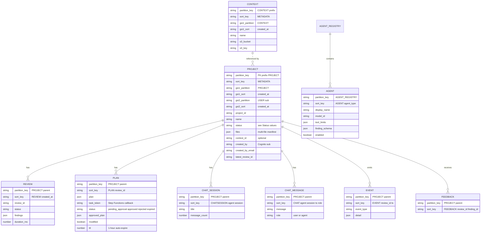

# Data Model

How data is organized across DynamoDB and S3. For the service view that places these stores in the broader application, see [aws-services.md](aws-services.md).

> **Last verified:** 2026-04-21 against `api/core/dynamodb.py`, `api/core/chat.py`, `api/core/progress.py`, `api/core/registry.py`, `api/rest_api/data_access/`, and `terraform/modules/data/`. Re-verify when adding a new item type, a new GSI, or a new S3 prefix.

## Summary

- **One DynamoDB table** (`{project_name}-projects-{env}`) holds everything except WebSocket connections.
- **Single-table design.** Composite `PK`/`SK` plus two GSIs cover all query patterns without scans.
- **One S3 bucket** holds user-uploaded documents (design documents and context documents) under prefix-scoped keys, plus workflow artifacts produced during a review.
- **Separate DynamoDB table** (`{project_name}-ws-connections-{env}`) tracks live WebSocket connections with TTL cleanup.

## DynamoDB — the projects table

### Keys and indexes

| Attribute | Purpose |
|-----------|---------|
| `PK` (hash) | Entity-type prefix + identifier, e.g. `PROJECT#<id>`, `CONTEXT#<id>`, or the literal string `AGENT_REGISTRY` |
| `SK` (range) | Child item discriminator or `METADATA` for the parent entity |
| `GSI1PK` / `GSI1SK` | Cross-entity lookup (list all projects, list all contexts, query the agent registry) — only set on entity metadata items |
| `GSI2PK` / `GSI2SK` | Per-user lookup (list projects owned by a specific Cognito user) |

Billing mode is PAY_PER_REQUEST. Point-in-time recovery is enabled (configurable). Server-side encryption uses AWS-managed KMS by default; a customer-managed KMS key can be supplied via `dynamodb_kms_key_arn`. `ttl` is the TTL attribute.

### Entities and their items

The table holds six entity types. An entity has one `METADATA` item (indexed by `GSI1` and/or `GSI2`) plus zero or more child items under the same `PK`.



### Access patterns

All read and write patterns in the hot path are served by either a `Query` on the primary key or a `Query` on `GSI1` / `GSI2`.

| Pattern | Approach |
|---------|----------|
| Get a project | `GetItem PK=PROJECT#<id>, SK=METADATA` |
| Get all items belonging to a project (for deletion or export) | `Query PK=PROJECT#<id>` |
| Get the latest review for a project | `Query PK=PROJECT#<id>, SK begins_with REVIEW#` with `Limit=1, ScanIndexForward=false` |
| Get the plan awaiting approval | `GetItem PK=PROJECT#<id>, SK=PLAN#<review_id>` |
| Get chat history for a session | `Query PK=PROJECT#<id>, SK begins_with CHAT#<agent>#<session_id>#` |
| List chat sessions for an agent | `Query PK=PROJECT#<id>, SK begins_with CHATSESSION#<agent>#` |
| Get review progress events since a cursor | `Query PK=PROJECT#<id>, SK between EVENT#<review_id>#<after> and EVENT#<review_id>#~` |
| List all projects (admin) | `Query GSI1 PK=PROJECT` |
| List projects owned by a user | `Query GSI2 PK=USER#<sub>` — used when a non-admin lists projects |
| List contexts | `Query GSI1 PK=CONTEXT` |
| Load the agent registry | `Query PK=AGENT_REGISTRY` — cached in-process with short TTL |
| Find stale `in_progress` reviews | `Query GSI1 PK=PROJECT` with server-side `FilterExpression` on status and `updated_at` (scheduled cleanup Lambda) |

### Why `GSI1PK` is only on entity metadata items

The `GSI1` index is deliberately sparse. Only the `METADATA` item for each entity (project, context) sets `GSI1PK`, so the index contains exactly one row per entity. Children (`REVIEW#`, `PLAN#`, `CHAT#`, `EVENT#`, `FEEDBACK#`) omit `GSI1PK` and don't appear in the index.

This keeps "list all projects" efficient — the index has O(projects) rows, not O(projects × reviews × chat_messages × events). It also means the stale-review cleanup job can `Query GSI1PK=PROJECT` and know every result is a project metadata item without post-filtering by type.

### Why the sort key for chat messages encodes role

Chat messages use `CHAT#{agent}#{session_id}#{timestamp}#{role_suffix}` where `role_suffix` is `0_USER` or `1_AGENT`. The numeric prefix guarantees that when user and agent messages share a millisecond timestamp, the user message sorts first — without this, retrieving a conversation could return the agent's reply before the user's prompt. Agent and session are in the sort key so retrieving one session's history is a clean prefix scan.

### TTL-backed items

Two item classes have meaningful TTL:

- **Plan items** — expire 1 hour after creation if the user hasn't approved or rejected. After expiry DynamoDB removes the item; the next approval attempt returns 404. The Step Functions execution's own task-token timeout handles the parallel cleanup of the paused execution.
- **WebSocket connections** (separate table, see below) — TTL cleans up connections that didn't fire `$disconnect`.

Reviews, chat history, events, feedback, and the agent registry have no TTL and are durable.

### Project status values

Projects move through a linear state machine:

```
pending → planning → plan_ready → in_progress → completed
                                              ↘ failed
```

`plan_ready` is the paused state where the workflow is waiting for user approval. Once approved, the project moves to `in_progress` (agents running), then `completed` or `failed`.

## DynamoDB — the connections table

A separate, much simpler table for WebSocket connection state.

| Attribute | Purpose |
|-----------|---------|
| `connectionId` (hash) | API Gateway-assigned WebSocket connection ID |
| `user_sub` | Cognito user sub; set if auth succeeded on `$connect` |
| `connectedAt` | ISO-8601 timestamp |
| `ttl` | TTL attribute, auto-cleans zombie connections |

Queried by `connectionId` (to fetch connection state) and by full-table `Scan` with a `FilterExpression` on `user_sub` (to look up a user's active connection when posting events from Lambdas). Scan is acceptable here because the table only contains rows for currently-connected users — typically small.

## S3 — the design documents bucket

One bucket holds all user-uploaded documents and workflow-produced artifacts. Encrypted (AES256), versioned, behind a `DenyInsecureTransport` bucket policy, with public access fully blocked.

```
{project_name}-design-docs-{env}-{account_id}/
├── projects/
│   └── {project_id}/
│       ├── <uploaded files>           ← design documents uploaded by the user
│       ├── plan.json                  ← produced by plan_review
│       ├── findings/                  ← per-agent structured findings
│       │   └── {agent_type}.json
│       └── image_analysis/            ← produced by load_document
│           └── ...
└── contexts/
    └── {context_id}/
        └── <context document>          ← organizational context markdown
```

- Uploads arrive via **pre-signed PUT URLs** (15-minute TTL) generated by the REST API. Browsers upload directly to S3; application code never receives the file bytes during upload.
- Downloads for display in the SPA use pre-signed GET URLs. Agents and workflow Lambdas use their IAM `s3:GetObject` permission instead.
- **Versioning** is enabled on the bucket. Non-current versions expire after 90 days. Standard-IA transition happens after 30 days for cost savings on design documents that are read rarely after the initial review.
- **CORS** is restricted to the configured `allowed_origins` (dev: `localhost:5173`; prod/staging: CloudFront distribution URL).

## S3 — the frontend bucket

Separate bucket for SPA artifacts. Readable only through CloudFront via Origin Access Control; the bucket policy grants `s3:GetObject` only to the CloudFront service principal conditioned on the distribution ARN. Contents are `index.html`, hashed asset files, and `config.json` (generated by Terraform from the main stack's outputs). Also protected by `DenyInsecureTransport`.

## Semantic memory and Knowledge Bases

Data that lives outside DynamoDB and S3:

- **AgentCore shared semantic memory** stores review findings as vector-searchable records, namespaced `/findings/{project_id}/{agent_type}`. Written by the `aggregate_results` workflow Lambda via `BatchCreateMemoryRecords`; read by chat agents via `retrieve_memory_records`. Event expiry is 90 days. Memory is populated by the review workflow; chat conversations are not written to it.
- **Document Index Knowledge Base** (Bedrock KB, S3 Vectors backend) holds the vectorized contents of uploaded design documents, populated by the `index_document` workflow Lambda. Used by both review and chat agents for RAG retrieval of the original source.
- **Standards Knowledge Base** (Bedrock KB, S3 Vectors backend) holds the compliance standards corpus. A fresh install ships one sample organisational policy in `standards/`; internal deployments add private corpora in `standards-*/` directories (e.g. `standards-AU-demo/`). Populated at deploy time from every `standards*/` directory present; re-synced on demand with `--sync`.

These are described in more detail in [aws-services.md](aws-services.md). They're mentioned here so "where does X data live?" has one authoritative answer.

## What's deliberately not in this doc

- **Cognito user data.** Lives in the Cognito User Pool, not a stack-managed store. Groups and attributes are documented in [security-architecture.md](security-architecture.md).
- **SSM Parameter Store contents.** Configuration handoff between stacks, not application data. Covered in [deployment-architecture.md](deployment-architecture.md).
- **CloudWatch Logs.** Operational data, not application data.
- **Exact schema of `findings`, `plan`, and `configurations` JSON blobs.** These follow the agent registry's `finding_schema` and the planner's tool schema. The authoritative definitions are the Pydantic models in `api/core/` and the agent `agent.yaml` files.
