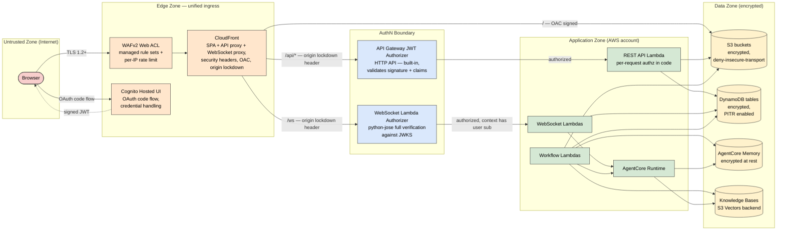
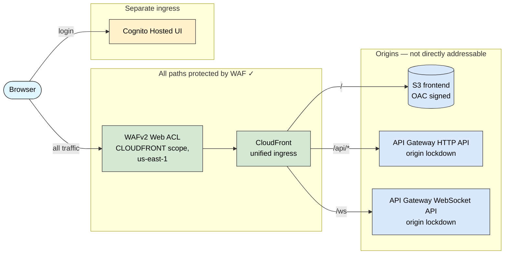
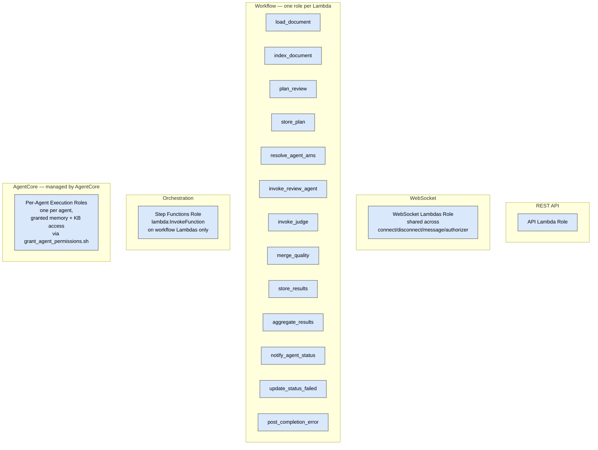

# Security Architecture

Trust boundaries, authentication and authorization, and data protection for the Solution Design Review application. Pair this with [aws-services.md](aws-services.md) for the resource view and [architecture-overview.md](architecture-overview.md) for the logical view.

> **Last verified:** 2026-04-21 against `terraform/`, `api/rest_api/app.py`, `api/websocket_handlers/authorizer.py`, and IAM policies. Re-verify when changing the auth model, adding a new compute role, or changing what a role can access.

For a detailed analysis with findings and recommendations, see [`.design_specs/done/security-review.md`](../.design_specs/done/security-review.md). This doc covers the as-built security posture.

## Trust boundaries

The boundaries, from outside in:

1. **Internet → Edge.** All browser traffic — SPA, API calls, and WebSocket connections — enters through a single CloudFront distribution with WAFv2 in front. Cognito Hosted UI handles login separately. API Gateway endpoints are not directly addressable from the internet; origin lockdown (shared secret header) rejects any request that didn't transit through CloudFront.
2. **Edge → AuthN.** Every call to the application API carries a Cognito-issued JWT. API Gateway's built-in JWT authorizer enforces this for the HTTP API; a custom Lambda authorizer enforces it for the WebSocket API. No authenticated traffic reaches application code without a valid signature.
3. **AuthN → Application.** Inside the application zone, Lambdas run with least-privilege IAM roles and enforce per-user authorization in code — passing the JWT is necessary but not sufficient.
4. **Application → Data.** All data at rest is encrypted. All data stores are accessed through scoped IAM permissions, not network reachability.

## Edge protection — WAF + origin lockdown

All traffic — SPA, REST API, and WebSocket — enters through a single CloudFront distribution with WAFv2 in front. API Gateway endpoints are not directly addressable from the internet.

### Defense layers (edge to data)

| Layer | What it does | Blocks |
|-------|-------------|--------|
| WAF managed rules | Inspects request bodies for SQLi, XSS, path traversal, Log4Shell, etc. | Unauthenticated exploit attempts |
| WAF rate limiting | 2000 req / 5 min per source IP | Brute force, credential stuffing, DDoS |
| Origin lockdown | Custom `X-Origin-Verify` header — CloudFront injects a shared secret; Lambda validates with constant-time comparison | Direct API access bypassing WAF |
| JWT authorizer | Validates Cognito-signed token (signature, issuer, audience, expiry) | Unauthenticated access |
| RBAC + ownership | Group-based permissions, per-user project scoping | Unauthorized access to other users' data |
| IAM least-privilege | Per-Lambda roles with minimal permissions | Lateral movement on compromise |
| Encryption | TLS in transit, AES256/KMS at rest | Data exposure |

### Origin lockdown

CloudFront injects an `X-Origin-Verify` header (shared secret generated by Terraform's `random_password`) on every request to the API and WebSocket origins. The REST API Lambda and WebSocket authorizer Lambda both validate this header using `hmac.compare_digest` (constant-time comparison to prevent timing attacks).

- **Dev** (`enable_api_proxy = false`): `ORIGIN_VERIFY_SECRET` env var is empty — all requests pass through. Developers hit API Gateway directly via Vite dev server.
- **Staging/Prod** (`enable_api_proxy = true`): requests without a valid `X-Origin-Verify` header are rejected with 403. The only way to reach the API is through CloudFront.

The secret lives in Terraform state (encrypted S3 backend with restricted access). Rotation: `terraform taint random_password.origin_verify` then `terraform apply` — updates both CloudFront and Lambda atomically.

### WAF rules

The Web ACL has three rules, all with CloudWatch metrics and sampled-request logging enabled. Default action is `allow`. All rules apply to every path — SPA, API, and WebSocket.

| Priority | Rule | Action | What it does |
|---------|------|--------|--------------|
| 1 | `AWSManagedRulesCommonRuleSet` | block (managed) | OWASP-ish core protections: SQLi, XSS, LFI, generic bad patterns |
| 2 | `AWSManagedRulesKnownBadInputsRuleSet` | block (managed) | Known-bad inputs: Log4Shell, path traversal, host-header injection, etc. |
| 3 | `RateLimitPerIP` | block | 2000 requests per 5 minutes per source IP (~6.7 req/s sustained) |

Managed rules run in block mode. If a rule produces false positives on API payloads (e.g. code snippets in review findings triggering SQLi rules), override that specific rule to count mode via `rule_action_override` in `terraform/modules/edge/waf.tf` — don't switch the entire rule group.

### WAF logging

Logs go to a dedicated CloudWatch log group (`aws-waf-logs-...` — AWS requires the prefix) with 30-day retention. The `Authorization` header is redacted from logs as a belt-and-braces measure, even though sampled requests don't include full JWTs by default.

For higher log volumes, CloudWatch should be swapped for S3 or Kinesis Firehose — CloudWatch is fine at dev/demo volume but gets expensive fast.

## Authentication

### User authentication — Cognito

Cognito User Pool with Hosted UI. OAuth 2.0 Authorization Code flow (no implicit flow). Frontend App Client is a **public client without a client secret** — suitable for SPAs because there's nowhere secure to store a secret in a browser.

Password policy: minimum 8 chars, requires lowercase, uppercase, numbers, and symbols. Account recovery via verified email only. Temporary password validity 7 days. `prevent_user_existence_errors = "ENABLED"` — Cognito returns the same error for "user not found" and "wrong password" to prevent user enumeration.

Token lifetimes:
- Access token: **1 hour**
- ID token: **1 hour**
- Refresh token: **30 days**

Three user groups carry authorization roles:
- `admins` — registry management and admin views
- `users` — standard users; own projects, all write operations
- `viewers` — read-only on all projects, plus chat

### HTTP API — built-in JWT authorizer

API Gateway HTTP API v2 uses its native JWT authorizer. Signature verification, issuer matching, audience matching, and expiry are enforced by API Gateway itself, upstream of any Lambda. The only unauthenticated route is `GET /health`.

On authorized requests, API Gateway forwards JWT claims into the Lambda event. The REST API Lambda reads `sub` and `email` to enforce per-user authorization (see below).

### WebSocket API — custom Lambda authorizer

WebSocket browsers can't set `Authorization` headers on the upgrade request, so the ID token is passed as `?token=<jwt>` on `$connect`. A REQUEST-type Lambda authorizer validates it.

The authorizer (`api/websocket_handlers/authorizer.py`) does **full cryptographic verification** using python-jose, not just claim parsing:

1. Fetches Cognito JWKS public keys (cached for 1 hour) from `cognito-idp.{region}.amazonaws.com/{pool_id}/.well-known/jwks.json`
2. Looks up the signing key matching the token's `kid` header
3. Verifies the RS256 signature
4. Enforces `issuer` = our User Pool and `audience` = our App Client ID
5. Enforces `token_use` = `id` (not an access token)
6. Enforces token expiry

On success, the authorizer returns an IAM allow policy with `principalId = user_sub` and context `{email, sub}`. All downstream WebSocket Lambdas read these from `event['requestContext']['authorizer']`.

Connection lifetime: the token is only checked at `$connect`. API Gateway holds WebSocket connections for up to 10 minutes of idle time; clients reconnect after idle timeout and re-authenticate.

## Authorization

JWT validation only proves *who* the caller is. What they can access is enforced in application code.

### Per-user project ownership

All project-scoped endpoints call `verify_project_ownership(project_id, user_sub)` before acting. Non-owners get `PermissionError` → 403.

Projects store `created_by` (Cognito `sub`) and `created_by_email` on creation. The per-user project list query uses **GSI2** (`USER#{user_sub}` / `{created_at}`) for efficient scoping without client-side filtering. Admins can see all projects; standard users see their own.

### Group-based authorization

The three Cognito groups map to distinct authorization paths in the REST API handlers:
- **Admins** can manage the agent registry and all projects
- **Users** can create, review, chat on, and delete their own projects
- **Viewers** can read and chat on all projects — no create, trigger, modify, or delete

Group membership is read from the JWT's `cognito:groups` claim on every request. Membership is not cached; revocation is immediate on group change.

## IAM — least-privilege roles

The application has **one IAM role per compute unit**, not one shared role. Each Lambda's execution role grants exactly the AWS permissions that Lambda needs — nothing more.

**Why per-Lambda roles matter:** a compromise of `load_document` can read project documents and write image-analysis output, but cannot start Step Functions executions, invoke agents, or write to DynamoDB. A compromise of `store_results` can only `PutItem` on the projects table — not read S3, not invoke Bedrock. Blast radius is bounded by role, not by process.

Highlights of role scoping (non-exhaustive):

| Role | What it can do (summary) |
|------|--------------------------|
| **REST API Lambda** | DynamoDB R/W (projects + GSIs), S3 R/W on design docs bucket (including pre-signed URL generation and project-delete cleanup), StartExecution/SendTaskSuccess on the review state machine, scan connections table (for WebSocket lookup), cleanup calls to AgentCore Memory and Document KB (on project delete) |
| **WebSocket Lambdas (shared)** | ManageConnections on the WebSocket API, DynamoDB R/W (projects + connections), InvokeAgentRuntime, RetrieveMemoryRecords, S3 read, SSM read on `/agent/*` (to resolve agent ARNs per request) |
| **Step Functions** | InvokeFunction only on the explicit list of workflow Lambda ARNs, direct DynamoDB PutItem/UpdateItem for status, X-Ray + CloudWatch Logs |
| **load_document** | S3 read/head/put on design docs, DynamoDB GetItem/PutItem, Bedrock InvokeModel for image analysis, WebSocket post |
| **plan_review** | Bedrock InvokeModel, DynamoDB Query/PutItem, S3 GetObject, WebSocket post |
| **invoke_review_agent** | InvokeAgentRuntime, BatchCreateMemoryRecords on shared memory, S3 GetObject, WebSocket post |
| **aggregate_results** | BatchCreateMemoryRecords on shared memory, S3 R/W, WebSocket post |
| **invoke_judge** | Bedrock InvokeModel, S3 GetObject, WebSocket post |
| **store_results** | DynamoDB PutItem only |
| **update_status_failed** / **post_completion_error** | Deliberately minimal — these are error-path handlers |
| **resolve_agent_arns** | DynamoDB Query, SSM GetParametersByPath on `/agent/*` |
| **Agent execution roles** | Created by AgentCore when an agent is deployed. `grant_agent_permissions.sh` grants chat agents `RetrieveMemoryRecords` on shared memory and KB retrieval where needed. |

Bedrock InvokeModel is scoped to Anthropic Claude foundation models and inference profiles (`arn:aws:bedrock:*::foundation-model/anthropic.claude-*` and `arn:aws:bedrock:*:*:inference-profile/*`). AgentCore invocation is scoped to the account's runtime ARNs.

## Data protection

### Encryption at rest

| Store | Encryption | Notes |
|-------|-----------|-------|
| S3 — design documents | AES256 (SSE-S3) | Bucket key enabled |
| S3 — frontend | AES256 (SSE-S3) | Bucket key enabled |
| DynamoDB — projects | AWS-managed KMS by default; customer-managed KMS supported via `dynamodb_kms_key_arn` | PITR enabled |
| DynamoDB — connections | AWS-managed KMS | TTL for stale cleanup |
| AgentCore Memory | Managed by Bedrock | |
| Knowledge Bases | Managed by Bedrock; S3 Vectors backend encrypted | |
| CloudWatch Logs | AWS-managed KMS | KMS for customer-managed key noted as recommended improvement |

### Encryption in transit

- **TLS 1.2+ everywhere.** CloudFront, API Gateway, S3, DynamoDB, and Bedrock endpoints all enforce TLS.
- **S3 buckets deny insecure transport.** Both the design-docs and frontend buckets have a bucket policy that denies any `s3:*` action where `aws:SecureTransport = false`.
- **WebSocket uses WSS.** `ws://` is never accepted.

### Content Security Policy (frontend)

The CloudFront response headers policy injects a CSP on SPA responses (a separate, CSP-free policy applies to API responses since CSP is only meaningful for HTML). The CSP restricts:
- `default-src 'self'` — no loading from third-party origins by default
- `connect-src 'self'` plus the Cognito hosted UI URL — in staging/prod, API and WebSocket traffic is same-origin through CloudFront, so no `execute-api` wildcards are needed. The Cognito URL is required for the OAuth `/oauth2/token` code-exchange fetch (cross-origin).
- `frame-ancestors 'none'` — the SPA can't be iframed
- `style-src 'self' 'unsafe-inline'` — inline styles allowed because Vite injects them at runtime
- `img-src 'self' data:` — data URLs allowed for inlined icons

Additional response headers:
- `Strict-Transport-Security: max-age=31536000; includeSubDomains; preload`
- `X-Content-Type-Options: nosniff`
- `X-Frame-Options: DENY`
- `Referrer-Policy: strict-origin-when-cross-origin`

### S3 buckets

- **Public access is fully blocked** on both buckets (`block_public_acls`, `block_public_policy`, `ignore_public_acls`, `restrict_public_buckets`).
- The **frontend bucket** is readable only through CloudFront via Origin Access Control — the bucket policy grants `s3:GetObject` only to the CloudFront service principal, conditioned on the specific distribution ARN.
- The **design-docs bucket** uses CORS restricted to the allowed origins list (dev: `http://localhost:5173`; prod: CloudFront URL), and pre-signed URLs (15 minute TTL) for browser uploads.

### Secrets and config

- **No hardcoded secrets** in code, Terraform, or container images.
- **Cognito App Client is a public client** (no client secret) — the OAuth code flow is designed for this.
- **Model IDs and non-secret config** flow through SSM Parameter Store (`String` type, not `SecureString` — they aren't secrets).
- **`.env` files are gitignored.** They hold local AWS profile names and developer-specific overrides, not credentials.

## Monitoring and audit

- **CloudWatch Logs** on every Lambda (with configurable retention — 7 days in dev by default), on both API Gateway stages, and on the Step Functions state machine.
- **API Gateway access logs** capture `requestId`, source IP, method, route, status, and integration error for every request on both HTTP and WebSocket APIs.
- **CloudWatch alarms** on Lambda errors, duration (approaching timeout), and throttles; on API Gateway 5xx and latency; on DynamoDB read/write throttle events.
- **X-Ray active tracing** on Lambdas, the state machine, and API Gateway — distributed traces span the whole review workflow.
- **CloudTrail** is account-wide and not configured by this stack; audit of AWS API calls relies on the account-level CloudTrail configuration.

## What's deliberately not in scope here

- **Per-finding authorization.** All findings in a project are visible to anyone with access to the project. There's no finding-level access control.
- **Multi-tenant network isolation.** All Lambdas run in the AWS-managed Lambda VPC; there's no per-tenant VPC isolation.
- **Bring-your-own-key (BYOK) for all stores.** DynamoDB supports CMK via `dynamodb_kms_key_arn`; S3 currently uses SSE-S3. CMK across all data stores is tracked as a future improvement.
- **Data residency.** Data lives in the configured `AWS_REGION` plus `us-east-1` for CloudFront/WAF. No multi-region replication; no residency guarantees.

## Known gaps and planned improvements

See [`.design_specs/done/security-review.md`](../.design_specs/done/security-review.md) for the full analysis. High-level summary of areas tracked for improvement:

- **Input validation hardening** — beyond JSON schema at API Gateway, deeper payload validation in handlers.
